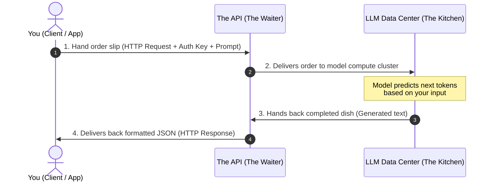

# Decode LLM APIs — A Plain-English Beginner's Guide
### From Raw `curl` to Python SDKs to LangChain

> A learner-friendly walkthrough of LLM APIs. If official API docs feel overwhelming, start here.

**Author**: Santosh Parsa  
**Audience**: Developers and beginners who want to understand *what* LLM APIs are, *how* they work under the hood, and *how* to build with them from scratch.

---

## Table of Contents
1. [Core Mental Model: What is an LLM API?](#1-core-mental-model-what-is-an-llm-api)
2. [The 3 Iron Laws of LLMs](#2-the-3-iron-laws-of-llms)
3. [Tier 1: The Bare Metal (`curl`)](#3-tier-1-the-bare-metal-curl)
4. [Tier 2: The Official Python SDK](#4-tier-2-the-official-python-sdk)
5. [Tier 3: The Framework Level (LangChain)](#5-tier-3-the-framework-level-langchain)
6. [Decision Framework: Which One Should You Use?](#6-decision-framework-which-one-should-you-use)
7. [The LLM Survival Guide (Troubleshooting & Errors)](#7-the-llm-survival-guide-troubleshooting--errors)

---

## 1. Core Mental Model: What is an LLM API?

Before touching any code, let's demystify what is actually happening.

An **LLM (Large Language Model)** such as GPT-4o, Claude 3.5, or Gemini 1.5 is an advanced text-prediction engine running in a massive cloud data center. You give it some text; it calculates the statistical probability of what characters or words should follow.

An **API (Application Programming Interface)** is simply the standard way two computers talk to each other over the web.

### The Restaurant Analogy



1. **You (The Client):** You write down an order on a slip of paper.
2. **The API (The Waiter):** Takes your order securely across the internet.
3. **The LLM (The Kitchen):** Generates the response.
4. **The Response:** The waiter brings back a structured tray of data (**JSON**) containing the answer and billing details.

---

## 2. The 3 Iron Laws of LLMs

Every beginner stumbles on these three concepts. Memorize them early:

### Law 1: Total Statelessness (The Amnesia Rule)
LLMs have zero memory between requests. When an API call finishes, the model completely forgets who you are, what you asked, and what it answered. 
> [!IMPORTANT]
> If you want a conversational back-and-forth like ChatGPT, **you must resend the entire conversation history with every single new question**.

### Law 2: Tokens $\neq$ Words
LLMs do not count words or letters. They process text in chunks called **tokens**.
- `1 token` $\approx$ 4 characters of English text.
- `100 tokens` $\approx$ 75 English words.
- Providers bill you on two distinct rates:
  - **Input Tokens (Prompt):** What you send to the model (cheaper).
  - **Output Tokens (Completion):** What the model writes back to you (more expensive).

### Law 3: Your API Key is a Credit Card
Your API key (e.g., `sk-proj-...`) authenticates your account. Anyone with your key can run queries billed directly to your account balance.
> [!CAUTION]
> Never commit an API key to GitHub, paste it into public forums, or hardcode it directly into frontend browser code.

---

## 3. Tier 1: The Bare Metal (`curl`)

`curl` is a command-line tool pre-installed on macOS, Linux, and Windows 10+. It sends raw network requests directly to an endpoint.

Starting with `curl` proves that an LLM API is not a magic library; it is just standard web traffic (**an HTTP POST request**).

### The Minimal Working Request

Open your terminal and paste this command (replace `YOUR_API_KEY` with your actual key):

```bash
curl https://api.openai.com/v1/chat/completions \
  -H "Content-Type: application/json" \
  -H "Authorization: Bearer YOUR_API_KEY" \
  -d '{
    "model": "gpt-4o-mini",
    "messages": [
      {
        "role": "user",
        "content": "Explain what an API is in one short sentence."
      }
    ],
    "temperature": 0.7
  }'
```

---

### Dissecting the Command

| Flag / Parameter | What it does | Plain English Explanation |
| :--- | :--- | :--- |
| `https://api.openai.com/v1/chat/completions` | Target URL | The web address of the LLM endpoint. |
| `-H "Content-Type: application/json"` | HTTP Header | *"I am sending you data structured as JSON."* |
| `-H "Authorization: Bearer YOUR_KEY"` | HTTP Header | *"Here is my secret badge so you know who to bill."* |
| `-d '{ ... }'` | Request Data | The JSON payload containing your instructions. |
| `"model": "gpt-4o-mini"` | Model Parameter | Which specific model version to invoke. |
| `"messages": [...]` | Dialogue Array | The conversation history (see below). |
| `"temperature": 0.7` | Sampling Knob | Controls randomness (`0.0` = factual/rigid, `1.0` = creative). |

---

### Understanding the 3 Dialogue Roles

Every message inside the `"messages"` array must have a `role` and `content`:

```json
"messages": [
  {
    "role": "system",
    "content": "You are a senior Linux sysadmin who answers with extreme brevity."
  },
  {
    "role": "user",
    "content": "How do I check free disk space?"
  }
]
```

1. **`system`**: Sets the rules, persona, boundaries, and tone of the model.
2. **`user`**: The question or prompt coming from the human.
3. **`assistant`**: The AI's previous responses (used when feeding chat history back to the model).

---

### The Response JSON (What You Get Back)

The server responds with a JSON string:

```json
{
  "id": "chatcmpl-A8xY9q...",
  "object": "chat.completion",
  "created": 1726315200,
  "model": "gpt-4o-mini",
  "choices": [
    {
      "index": 0,
      "message": {
        "role": "assistant",
        "content": "An API is a set of rules that allows different software applications to communicate and share data with one another."
      },
      "finish_reason": "stop"
    }
  ],
  "usage": {
    "prompt_tokens": 19,
    "completion_tokens": 22,
    "total_tokens": 41
  }
}
```

- **`choices[0].message.content`**: The actual text generated by the model.
- **`finish_reason`**: Why the model stopped generating.
  - `"stop"`: Naturally reached the end of its thought.
  - `"length"`: Cut off because it hit `max_tokens`.
- **`usage`**: Exact count of tokens billed for this round-trip.

---

## 4. Tier 2: The Official Python SDK

While `curl` is great for quick terminal tests, writing raw JSON and parsing strings in application code is error-prone. Official libraries provide:
- Automatic JSON formatting and response extraction
- Built-in retry logic for temporary network dropouts
- Type safety and IDE auto-completion

### Step 1: Environment Setup

Install the official OpenAI package:

```bash
pip install openai
```

Store your API key in your terminal environment so Python can find it automatically:

```bash
export OPENAI_API_KEY="sk-proj-your-actual-api-key"
```

---

### Step 2: The Single-Call Script

Create a file named `simple_call.py`:

```python
import os
from openai import OpenAI

# 1. Initialize the client (automatically reads OPENAI_API_KEY from environment)
client = OpenAI()

# 2. Make the API request
response = client.chat.completions.create(
    model="gpt-4o-mini",
    messages=[
        {"role": "system", "content": "You are a helpful software tutor."},
        {"role": "user", "content": "What is the difference between a list and a set in Python?"}
    ],
    temperature=0.2, # Low temperature for accurate, factual answers
    max_tokens=200   # Guardrail to limit token consumption
)

# 3. Read the generated response
reply_text = response.choices[0].message.content
print(reply_text)
```

---

### Step 3: Solving the Amnesia Problem (Multi-Turn Chat)

Because of **Law #1 (Statelessness)**, if you want a back-and-forth dialogue, you maintain a Python list of turns:

```python
from openai import OpenAI

client = OpenAI()

# Initialize the conversation with a system instruction
conversation_history = [
    {"role": "system", "content": "You are a concise AI assistant."}
]

def chat(user_message: str) -> str:
    # 1. Append the user's new message to the list
    conversation_history.append({"role": "user", "content": user_message})

    # 2. Send the ENTIRE list to the API
    response = client.chat.completions.create(
        model="gpt-4o-mini",
        messages=conversation_history
    )

    # 3. Extract the response text
    assistant_reply = response.choices[0].message.content

    # 4. Append the assistant's reply so the model remembers it next turn!
    conversation_history.append({"role": "assistant", "content": assistant_reply})

    return assistant_reply

# Turn 1
print("User: Hi, my name is Alex and I live in Tokyo.")
print("AI:  ", chat("Hi, my name is Alex and I live in Tokyo."))

# Turn 2
print("\nUser: What is my name and where do I live?")
print("AI:  ", chat("What is my name and where do I live?"))
```

---

### Step 4: Real-Time Streaming (The Typewriter Effect)

Normally, the API waits until the entire paragraph is generated before sending anything. By passing `stream=True`, you receive tokens as they are generated:

```python
from openai import OpenAI

client = OpenAI()

stream = client.chat.completions.create(
    model="gpt-4o-mini",
    messages=[{"role": "user", "content": "Write a 3-sentence story about a robotic kitten."}],
    stream=True # <--- Activates streaming mode
)

for chunk in stream:
    token = chunk.choices[0].delta.content or ""
    print(token, end="", flush=True)

print()
```

---

## 5. Tier 3: The Framework Level (LangChain)

### Why LangChain if the SDK is already so clean?

When moving from a simple 20-line script to a real application, you encounter recurring engineering problems:
1. **Dynamic Prompts:** You need templates with reusable variables.
2. **Provider Lock-in:** Swapping between OpenAI, Claude, and Gemini requires rewriting API calls.
3. **Structured Output:** You need the LLM to return valid Python objects or JSON, not conversational prose.
4. **Pipelines:** You need to feed the output of one step into another (e.g., Search Web $\to$ Format $\to$ Summarize).

LangChain solves this using **LCEL (LangChain Expression Language)** via the pipe operator (`|`):

$$\text{Input} \longrightarrow \text{PromptTemplate} \longrightarrow \text{Model} \longrightarrow \text{OutputParser} \longrightarrow \text{Clean Output}$$

---

### Step 1: Install LangChain

```bash
pip install langchain langchain-openai pydantic
```

---

### Step 2: The Core LCEL Pipeline

```python
from langchain_core.prompts import ChatPromptTemplate
from langchain_core.output_parsers import StrOutputParser
from langchain_openai import ChatOpenAI

# 1. Define a Prompt Template with a dynamic variable {topic}
prompt = ChatPromptTemplate.from_messages([
    ("system", "You are an expert technical writer. Explain topics simply for novices."),
    ("user", "Explain {topic} using a real-world kitchen analogy.")
])

# 2. Define the Model
model = ChatOpenAI(model="gpt-4o-mini", temperature=0.3)

# 3. Define the Output Parser (extracts string content directly from model response)
parser = StrOutputParser()

# 4. Assemble the chain using the pipe operator (|)
chain = prompt | model | parser

# 5. Run the chain with inputs
output = chain.invoke({"topic": "Kubernetes Pods"})
print(output)
```

---

### Step 3: Swapping Models Without Changing Business Logic

If you want to switch from OpenAI to Anthropic Claude or Google Gemini, only one line changes:

```python
# To switch to Anthropic:
# pip install langchain-anthropic
from langchain_anthropic import ChatAnthropic

# Change the model component:
model = ChatAnthropic(model="claude-3-5-sonnet-20241022")

# Your pipeline logic remains completely unchanged:
chain = prompt | model | parser
```

---

### Step 4: Strict Structured Outputs (Pydantic)

In production, you often need the LLM to populate a database or trigger an API rather than write paragraphs. LangChain allows you to enforce rigid schema validation:

```python
from pydantic import BaseModel, Field
from langchain_openai import ChatOpenAI

# 1. Define the exact schema you want back
class BugReport(BaseModel):
    summary: str = Field(description="One-sentence summary of the bug")
    severity: str = Field(description="Must be: Low, Medium, High, or Critical")
    affected_component: str = Field(description="The component affected (e.g. Auth, DB, UI)")
    suggested_fix: str = Field(description="Recommended troubleshooting step")

# 2. Attach schema to the model
model = ChatOpenAI(model="gpt-4o-mini")
structured_model = model.with_structured_output(BugReport)

# 3. Query the model with messy raw text
raw_user_complaint = (
    "Users are reporting that when they hit the checkout button on mobile Safari, "
    "the page spins indefinitely and never completes payment authorization."
)

result: BugReport = structured_model.invoke(raw_user_complaint)

# Result is a typed Python object!
print(f"Summary:    {result.summary}")
print(f"Severity:   {result.severity}")
print(f"Component:  {result.affected_component}")
print(f"Fix:        {result.suggested_fix}")
```

---

## 6. Decision Framework: Which One Should You Use?

| Feature | `curl` | Official SDK (`openai`) | LangChain |
| :--- | :--- | :--- | :--- |
| **Setup Cost** | Zero (already installed) | Low (`pip install openai`) | Moderate (`pip install langchain`) |
| **Best For** | Health checks, testing API keys | Standard chatbots, focused scripts | RAG, multi-agent workflows, pipelines |
| **Complexity** | Low | Low–Medium | Medium–High |
| **Prompt Engineering** | Manual string concatenation | Python f-strings | Reusable `ChatPromptTemplate` |
| **Model Portability** | Manual URL/header changes | Rewriting provider client code | 1-line swap of model class |
| **Structured Output** | Manual JSON schema formatting | Built-in `response_format` | Native Pydantic integration |

### Quick Rule of Thumb:
- Use **`curl`** when you suspect an outage or want to test if an API key works in 5 seconds.
- Use the **Official SDK** for 80% of normal applications (chatbots, summaries, basic scripts).
- Use **LangChain** only when you need multi-model orchestration, vector database retrieval (RAG), or agentic tool use.

---

## 7. The LLM Survival Guide (Troubleshooting & Errors)

### Common HTTP Status Codes

- **`401 Unauthorized`**  
  - *Cause:* Invalid, expired, or missing API key.  
  - *Check:* Run `echo $OPENAI_API_KEY` to ensure the variable is actually exported in your shell.
- **`429 Too Many Requests`**  
  - *Cause:* You hit your rate limit (requests per minute) **or** your account has depleted its prepaid credit balance.
  - *Check:* Verify your billing balance on the provider's web dashboard.
- **`500 / 503 Server Error`**  
  - *Cause:* The provider (OpenAI, Anthropic, etc.) is undergoing high load or an outage.  
  - *Remedy:* Implement exponential backoff retry logic.

### 4 Golden Rules for Production
1. **Never hardcode keys.** Always use `.env` files and add `.env` to `.gitignore`.
2. **Set `max_tokens` when experimenting.** An uncontrolled loop with an unbounded token limit can rapidly rack up costs.
3. **Use low temperatures for structured data.** Set `temperature=0.0` when extracting JSON or classifying data.
4. **Log your token usage.** Always inspect `usage.total_tokens` so you understand your unit economics.
