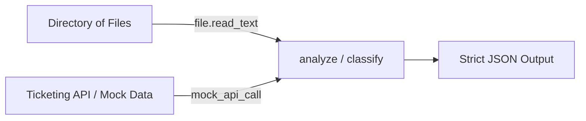

# How to Write AI Mail Analysis & Triage — Beginner's Guide
### Decode AI with Santosh

> A crystal-clear, zero-jargon guide for absolute beginners to understand how to read files from a directory, send them to an AI model, and receive clean, structured JSON.

**Author**: Santosh Parsa  
**Audience**: Absolute beginners, self-learners, interview candidates, and competitive programmers.

---

## 1. What Are We Building?

Imagine working in customer operations or IT support:
1. Emails arrive constantly into a shared folder or directory (e.g., `/root/mails/` or `./sample_emails/`).
2. Someone needs to read every single email and answer:
   * **Intent:** Is this a *Billing issue*, *Bug report*, or *Sales lead*?
   * **Urgency:** Is it *Critical* (servers down) or *Low*?
   * **Sentiment:** Is the customer *Happy*, *Neutral*, or *Frustrated*?
   * **Action:** What should we do next?
3. **Our Tool's Job**:
   - Open the directory.
   - Read every email file.
   - Hand the text to an AI model.
   - Get back a structured **JSON sticky note** with tags for easy automation.

> [!TIP]
> **Do You Need LangChain?**  
> **No!** Frameworks like LangChain add unnecessary abstraction layers that confuse beginners. Plain Python plus the official LLM SDK is faster, transparent, and 10x easier to debug.

---

## 2. The 4-Step Mental Formula

Whenever you write code that processes items with an AI model, memorize this 4-step loop:

```text
Step 1: FIND FILES   -->  Look inside the folder: Path(dir).glob("*")
Step 2: READ FILE    -->  Extract the text: file.read_text()
Step 3: ASK AI       -->  Send prompt & enforce strict JSON output
Step 4: PARSE JSON   -->  Convert AI text into a Python dictionary: json.loads()
```

---

## 3. Core Concepts Explained Simply

### A. Why `from pathlib import Path` and not `import Path`?

Think of it like shopping for tools:
* **`pathlib`** = The **Toolbox / Module** (The file `pathlib.py` installed with Python).
* **`Path`** = The **Hammer / Class** inside the toolbox.

```python
# ❌ FAILS: Python has no package named "Path"
import Path

# 📦 OPTION 1: Bring the whole toolbox (verbose)
import pathlib
folder = pathlib.Path("/root/mails")

# 🔨 OPTION 2: Pull out just the hammer (clean & recommended)
from pathlib import Path
folder = Path("/root/mails")
```

#### The 3-Level Ladder:
```text
Level 1: MODULE  --> pathlib     (The Factory / Python file)
Level 2: CLASS   --> Path        (The Blueprint inside the factory)
Level 3: OBJECT  --> folder      (The actual variable holding "/root/mails")
```

---

### B. What is `glob`?

`glob` is Python's **file search bar**. The name comes from "global pattern match", and uses the wildcard `*`:
* `*` means: *"Match anything here, I don't care what it is."*

| Code | What it matches |
| :--- | :--- |
| `folder.glob("*")` | All files in the folder |
| `folder.glob("*.txt")` | Only files ending with `.txt` |
| `folder.glob("email_*")` | Files starting with `email_` |
| `folder.rglob("*.txt")` | Recursive search: searches all subfolders too |

#### Why wrap it in `list()`?
`glob` acts like a conveyor belt (generator). It doesn't calculate the total number of files up-front.
* If you only want to loop: `for file in folder.glob("*"):` works directly!
* If you want to **count** files first: wrap it in `list(folder.glob("*"))` so you can run `len(files)`.

---

### C. How to Force the Model to Return Strict JSON

Normally, LLMs are chatty:
> *"Sure! Here is your email classification: ... ```json { ... } ```"*

To eliminate all conversational filler and guarantee valid JSON, use:
```python
response_format={"type": "json_object"}
```
This forces the model to emit raw JSON text directly.

---

### D. Why `json.loads(...)`?

The AI returns a **string** of characters.  
To access values like `result["urgency"]` in Python, you use `json.loads()` (**"load string"**) to convert the text into a real Python dictionary.

---

## 4. Script Anatomy: Where to Start?

Think of your script like a **cooking recipe**:

```text
1. INGREDIENTS  --> Imports at the top (import json, from pathlib import Path)
2. PREP WORK    --> Helper functions in the middle (def analyze_mail(...))
3. COOKING      --> The main workflow (def main(): ...)
4. START BUTTON --> if __name__ == "__main__": main()
```

### The Minimal Skeleton:
```python
import json
from pathlib import Path
from openai import OpenAI

client = OpenAI()

# 1. Helper: Call the AI
def analyze_mail(text):
    response = client.chat.completions.create(
        model="gpt-4o-mini",
        messages=[
            {"role": "system", "content": "Classify this email. Return only valid JSON."},
            {"role": "user", "content": f"Analyze: {text}"}
        ],
        response_format={"type": "json_object"}
    )
    return json.loads(response.choices[0].message.content)

# 2. Main workflow
def main():
    folder = Path("/root/mails")
    for file in folder.glob("*"):
        text = file.read_text()
        result = analyze_mail(text)
        print(result)

# 3. Start button
if __name__ == "__main__":
    main()
```

---

## 5. 🔮 Future Expansion: Reusing This Logic for Ticket Classification

A customer ticket (from Jira, Zendesk, or ServiceNow) and an email are **conceptually identical**: they are both pieces of user text that need classification.

In the future, you do not need to rewrite your code! You just swap **where the data comes from**:



### Example: Mocking Ticket API Data
```python
# Instead of reading from disk:
mock_tickets = [
    {"id": "TICKET-101", "body": "Cannot reset password. Error 403."},
    {"id": "TICKET-102", "body": "Requesting 50 new licenses for our marketing team."}
]

# The classification logic remains 100% the same!
for ticket in mock_tickets:
    analysis = analyze_mail(ticket["body"])
    print(f"Ticket {ticket['id']} classified as: {analysis['sender_intent']}")
```

---

## 6. Interview & Competition Survival Guide

Under pressure in an interview or coding contest, rely on these **3 visual rules**:

### Rule 1: The "Casing" Rule
* `lowercase` &rarr; **Module / Package** (`pathlib`, `json`, `os`)
* `Capitalized` &rarr; **Class / Blueprint** (`Path`, `OpenAI`)
* `snake_case` &rarr; **Object / Variable** (`my_folder`, `mail_file`)

### Rule 2: The "Where $\to$ What $\to$ Who" Formula
> *"From **WHERE**, take **WHAT**, to make **WHO**?"*

```python
#  WHERE          WHAT
from pathlib import Path

# WHO            WHAT
my_folder   =    Path("/root/mails")
```

### Rule 3: The "I-H-M-S" Script Skeleton
*(Mnemonic: **I** **H**ave **M**y **S**cript)*
1. **[I]**mports
2. **[H]**elpers
3. **[M]**ain
4. **[S]**tart button (`if __name__ == "__main__": main()`)

### 🚨 Emergency Lifeline (If You Blank Out)
If you freeze in a terminal, ask Python directly:
```python
from pathlib import Path
dir(Path)             # Lists every method available
help(Path.glob)       # Explains how glob works
help(Path.read_text)  # Explains how read_text works
```

If you forget `pathlib` on a whiteboard, use standard Python:
```python
with open("mail.txt") as f:
    text = f.read()
```

---

## 7. How to Run the Script

1. **Install requirements:**
   ```bash
   pip install openai
   ```

2. **Set your API Key:**
   ```bash
   export OPENAI_API_KEY="your-api-key-here"
   ```

3. **Run:**
   ```bash
   python mail_analysis.py
   ```

*(If `/root/mails` does not exist, the script automatically creates a `sample_emails/` folder with demo emails so you can test immediately!)*
