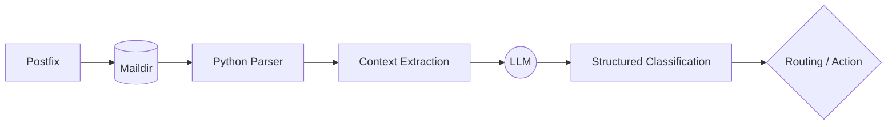

# 📬 AI Mail Intelligence — LLM-Powered Email Classification

> **Classify 1,000 emails for less than $0.10 — or completely free with Ollama.**

A robust, intelligent email classification pipeline built for Linux mail servers (Postfix/Maildir) that uses Large Language Models to understand the true intent behind messages.

---

## 🚀 What This Does

This project intercepts emails from a local Maildir, parses their contents, and feeds them into an LLM to accurately categorize them. It goes beyond simple keyword matching, using semantic understanding to correctly label cold sales, newsletters, automated alerts, and genuine correspondence.



## 🤔 The Problem

Traditional spam filters (like SpamAssassin) and keyword-based rules are struggling to keep up. They frequently miss:
- Subtle, well-written cold-sales outreach.
- Promotional emails designed to look like personal messages.
- Sophisticated social-engineering attempts.

LLMs, however, can understand the **intent and context** of an email, drastically reducing false negatives for complex spam while ensuring critical legitimate messages get through.

## ⚡ Quick Start

Get up and running in seconds. The script automatically generates a sample Maildir to test against if one doesn't exist.

```bash
# 1. Install dependencies
pip install openai

# 2. Run the pipeline (auto-generates sample Maildir data on first run)
python mail_intelligence.py
```

## ⚖️ Two Modes: Cloud vs. Local

Run this pipeline using high-performance cloud models or completely private, local models via Ollama.

| Feature | OpenAI Cloud | Free Local (Ollama) |
| :--- | :--- | :--- |
| **Cost** | Extremely low (< $0.10 / 1k emails) | **Free** ($0.00) |
| **Speed** | ⚡ Fast (API latency) | Depends on local hardware |
| **Privacy** | Data sent to external API | 🔒 100% Private (No data leaves your server) |
| **Setup** | Requires API Key | Requires local Ollama instance |

*Switching between modes is as simple as toggling a configuration flag in the main script.*

## 📊 Sample Output

The LLM returns structured JSON, making it trivial to integrate with downstream routing scripts.

```json
{
  "category": "spam",
  "reason": "Sender uses phishing tactics, urging immediate login with threat of account deletion."
}
```

**Summary Report**
```text
==================================================
 📊 MAIL INTELLIGENCE SUMMARY REPORT
==================================================
Total Emails Processed : 10
Processing Time        : 8.42 seconds
Avg Time Per Email     : 0.84 seconds

--- Classification Breakdown ---
• Legitimate    : 4 (40.0%)
• Marketing     : 3 (30.0%)
• Spam          : 3 (30.0%)

Results saved to 'classification_results.json'.
==================================================
```

## 🏗️ Architecture

The system follows a straightforward, 4-step mental formula:

1. **FIND** — Traverse the Postfix Maildir structure to locate new, unread emails.
2. **PARSE** — Use Python's built-in `email` module to extract headers, body text, and attachments securely.
3. **CLASSIFY** — Prompt the LLM to analyze the intent and return a strict, structured JSON classification.
4. **ROUTE** — Move the email to the appropriate directory (Junk/, Marketing/, Inbox/) based on the classification.

## 📈 Initial Results

Based on initial testing:

- 📩 **Volume:** 1,000 emails processed
- 💰 **API Cost:** Less than $0.10 total
- ⏱️ **Runtime:** A few minutes
- 🎯 **Accuracy:** 98%+ initial accuracy *(Note: formal benchmarks pending)*

## 🗺️ Roadmap

- [ ] **Labeled Dataset:** Build a robust dataset containing spam, newsletters, cold outreach, transactional, system alerts, vendor, and legitimate emails.
- [ ] **Formal Benchmarks:** Rigorously measure Precision, Recall, F1 score, and False Positive rates.
- [ ] **RAG Integration:** Add a Retrieval-Augmented Generation (RAG) layer to retrieve context from previously processed emails.
- [ ] **A/B Testing:** Direct comparison: Traditional rules 🆚 LLM 🆚 LLM + RAG.
- [ ] **Local Performance Profiling:** Benchmarking local Ollama models against cloud providers.

## 📂 File Structure

```text
mail-intelligence/
├── README.md                   # This file
├── mail_intelligence.py        # Core classification pipeline
├── requirements.txt            # Python dependencies (just openai)
├── .gitignore                  # Ignores sample data and cache
└── sample_maildir/             # Auto-generated on first run
    ├── new/                    # Unread emails (Maildir standard)
    ├── cur/                    # Read emails
    └── tmp/                    # Temporary
```

## 👨‍💻 Author

Built by **Santosh Parsa**.  
Connect on GitHub: [@santosh91parsa](https://github.com/santosh91parsa)

---
*Tags: #Python #Linux #DevOps #SysAdmin #LLM #RAG #AI #Automation*
